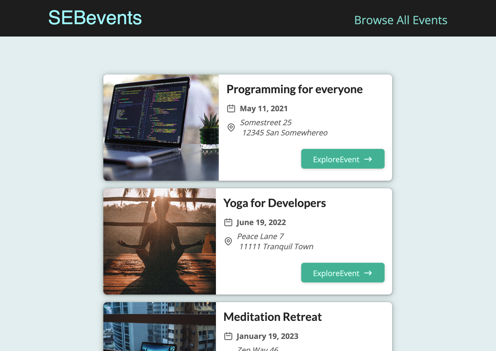

# SEBevents - Next.js Routing Learning Application

This repository is a basic Next.js application created to understand the routing mechanisms of Next.js. Dive into the code to learn:

- How files and folders in the `pages` directory are translated into accessible routes.
- The functioning of slug routes.
- How single parameter routes work.
- Integrating regular React components with Next.js page components.
- Utilizing the `useRouter` hook for programmatic navigation and accessing data encoded in the URL.

## Application Overview

SEBevents is a straightforward application with:

- **Landing Page**: Showcases featured events.
- **Browse All Events Page**: Users can filter events based on month and year. Every event is represented as a card with pertinent details.
- **Event Details Page**: Provides detailed information about an individual event. It also incorporates error handling to manage situations where an event isn't found or if a user enters an incorrect route.

## Live Demo

View the deployed application on Vercel: [SEBevents Live Demo](https://seb-events.vercel.app/)

## Screenshots & GIFs




## Running Locally

To get the app running on your local machine, follow these instructions:

1. **Clone the repository**:

   ```bash
   git clone git@github.com:missatrox44/nextjs-events.git
   ```

2. **Navigate to the directory**:

   ```bash
   cd nextjs-events
   ```

3. **Install the dependencies**:

   ```bash
   npm install
   ```

4. **Run the application**:

   ```bash
   npm run dev
   ```

The application will start running on `http://localhost:3000`. Open it in your browser to view.
